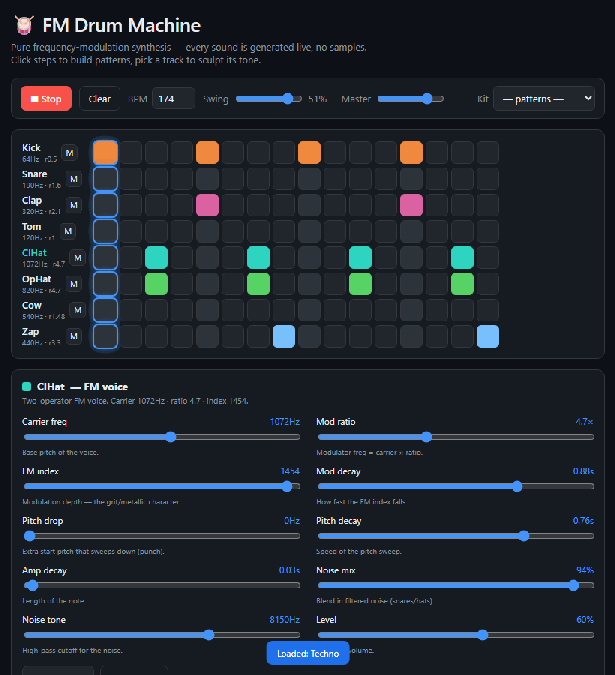
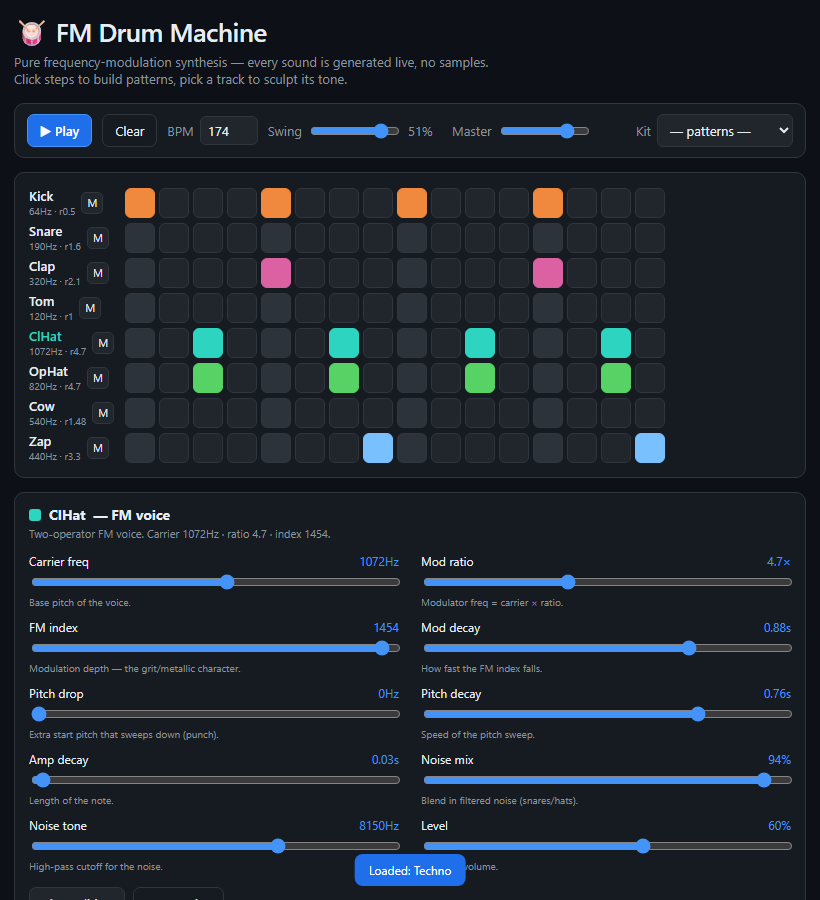

# FM Drum Machine — Copilot canvas extension

A GitHub Copilot **canvas extension** that adds a step-sequencer drum machine to the
Copilot side panel. Every sound is generated live with **two-operator frequency
modulation** (Web Audio) — there are no samples anywhere.

 



> Running a techno pattern — the highlighted column is the playhead stepping through
> 16th notes while every voice is synthesized live via FM.



## What it does

- **16-step sequencer** across 8 drum voices (Kick, Snare, Clap, Tom, Closed/Open
  Hat, Cowbell, Zap). Click cells to program a pattern.
- **Live FM synth engine** — each voice is a carrier oscillator modulated by a second
  oscillator, with independent pitch, modulation-index, and amplitude envelopes.
- **Per-voice sound design** — select a track and sculpt 10 parameters:
  carrier frequency, mod ratio, FM index, mod decay, pitch drop & decay, amp decay,
  noise mix, noise tone, and level. Changes audition instantly.
- **Transport** — play/stop, BPM (40–300), swing, master volume.
- **Starter patterns** — four-on-the-floor, boom bap, breakbeat, techno.
- **Persistent kits** — patterns and voice settings are saved per `kitId` to a JSON
  artifact, so your work survives reloads.

## How the synthesis works

Each hit calls `playVoice()`, which builds this graph:

```
modulator osc ──▶ modGain (index envelope, Hz of deviation)
                      │
                      ▼
carrier osc.frequency  (sine, pitch envelope: startFreq → base)
   │
   ▼
amp gain (exp attack/decay) ──▶ master ──▶ destination

(optional)  noise buffer ──▶ highpass ──▶ noise gain ──▶ master
```

- The **modulator** runs at `carrier × ratio`. Its output is scaled by `modGain`,
  whose value is the instantaneous **frequency deviation in Hz** and decays over
  `indexDecay` — that envelope is what gives kicks their click and hats their metallic
  sheen.
- The **carrier** sweeps from `carrier + pitchEnv` down to `carrier` over `pitchDecay`
  for punch.
- A filtered **noise** layer is mixed in for snares, claps, and hats.

The sequencer uses a Web Audio **lookahead scheduler** (schedules ~100 ms ahead on a
25 ms timer) for tight, drift-free timing independent of the JS event loop.

## Agent actions

The canvas also exposes two agent-callable actions:

| Action | Purpose |
| --- | --- |
| `load_pattern` | Overwrite a kit's saved state with a full pattern/voice JSON payload. |
| `get_pattern`  | Return a kit's saved JSON state (or `null`). |

## Install

This repo lays the extension out at `.github/extensions/drum-machine/`, so any Copilot
project using this repo picks it up automatically. To use it elsewhere, copy that
folder into one of:

- `.github/extensions/drum-machine/` (project, committed)
- `~/.copilot/extensions/drum-machine/` (user, personal)

Then reload extensions in Copilot and open the **FM Drum Machine** canvas.

## Files

- `.github/extensions/drum-machine/extension.mjs` — SDK wiring: serves the renderer on
  a loopback port and persists kit state.
- `.github/extensions/drum-machine/ui.html` — the self-contained Web Audio app
  (sequencer UI + FM engine).
